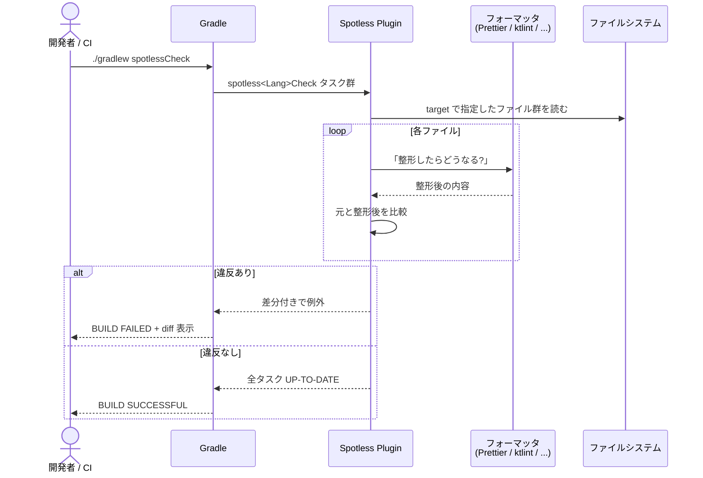
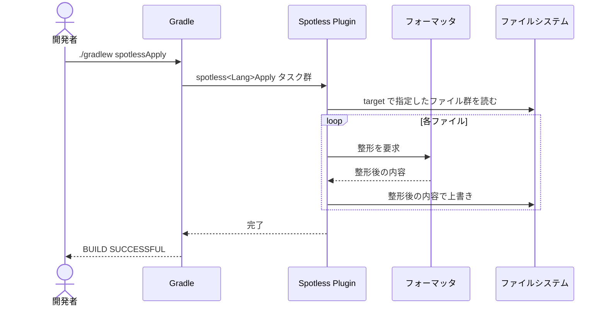
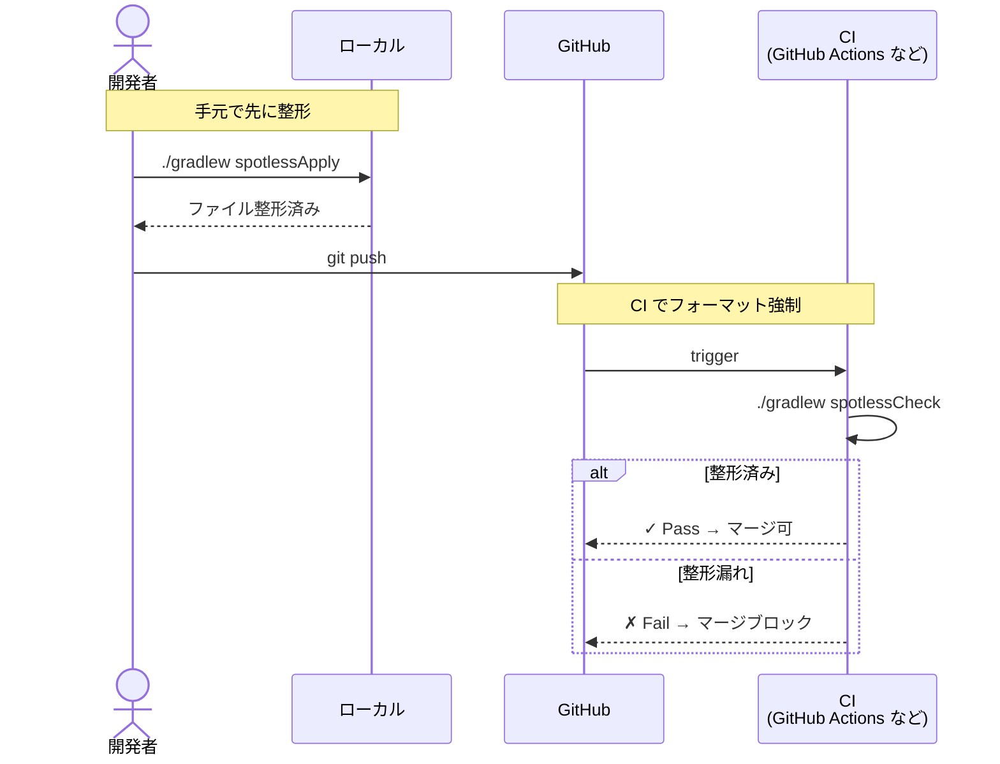

# spotless-demo

[Spotless](https://github.com/diffplug/spotless) (Gradle Plugin) を試すための実験プロジェクト集。

「Spotless 自身はフォーマッタではなく、**フォーマッタを束ねるためのフレームワーク**」という性質を、2 つのサブプロジェクトで体感できるようにした。

## サブプロジェクト

| ディレクトリ | 用途 | 使うフォーマッタ |
|---|---|---|
| [`prettier-web/`](prettier-web/) | JS / TS / CSS / HTML / Markdown / JSON / YAML を **Prettier** で一括 | `prettier("3.3.3")` |
| [`all-in-demo/`](all-in-demo/) | Java / Kotlin / Groovy / SQL / Markdown / JSON / YAML / XML / Protobuf を**全部入り**で | `googleJavaFormat` / `ktlint` / `greclipse` / `jackson` / `dbeaver` / `flexmark` ... |

両方とも **Gradle ベース** (Kotlin DSL) で、**Gradle Wrapper 同梱**。

```sh
./gradlew spotlessCheck   # フォーマット違反を検出 (CI 用)
./gradlew spotlessApply   # 自動修正 (手元用)
```

---

## アーキテクチャ

Spotless 自体は「フォーマッタを呼ぶための仕組み」だけを持つ。実際の整形ロジックはバンドルされた各フォーマッタ jar / Node モジュールが担当する。

```
[build.gradle.kts]
        ↓ 設定 (どのファイルに、どのフォーマッタを当てるか)
[Spotless Gradle Plugin]
        ↓ Maven Central / Node から取得
        ├──→ google-java-format  ┐
        ├──→ ktlint               │
        ├──→ greclipse            │
        ├──→ Jackson (JSON/YAML)  │ → src/**/* を読み書きして整形
        ├──→ dbeaver (SQL)        │
        ├──→ flexmark (Markdown)  │
        ├──→ Prettier (Web 全般)  │
        └──→ buf (Protobuf)       ┘
                ↓
        [src/**/* に書き戻す or 違反を出力]
```

つまり Spotless = **オーケストレーター**、各フォーマッタ = **実行部隊**。

---

## 動作シーケンス

### `./gradlew spotlessCheck` (CI 用: 違反検出)



### `./gradlew spotlessApply` (手元用: 自動修正)



### 実運用での組み合わせ (CI 統合)



ポイント: **`spotlessApply` を pre-commit hook に仕込む** か、**エディタで保存時にフォーマット** しておくと、CI で落ちるのを防げる。

---

## 動かしてみる (3 ステップ)

```sh
# 例: prettier-web の場合
cd prettier-web

# 1) わざと崩したサンプルが入っているので、check は失敗する
./gradlew spotlessCheck
# > Task :spotlessJsonCheck FAILED
# > The following files had format violations:
# >       src/data.json
# >       @@ -1 +1,6 @@ ...

# 2) apply で自動修正
./gradlew spotlessApply
# > BUILD SUCCESSFUL

# 3) 再度 check すると通る
./gradlew spotlessCheck
# > BUILD SUCCESSFUL
```

`all-in-demo/` 側でも同じ流れ。違うフォーマッタの違反 (Java/Kotlin/SQL/Markdown ...) が一度に見られる。

---

## 前提環境

- **Java 11+** (Spotless v6.25.0 が要求。このデモは Java 21 / Corretto で確認)
- **Node.js 16+** (`prettier-web/` のみ。Spotless が内部で npm を呼ぶ)
- Gradle 本体は **不要** (Wrapper 同梱)

---

## Spotless ざっくり

- **ビルドプラグイン**であって、それ自身はフォーマッタを持たない
- 中で `googleJavaFormat` / `ktlint` / `prettier` / `flexmark` / `jackson` / `dbeaver` などを呼ぶ
- 言語ごとに `java {}` `kotlin {}` `format("xxx") {}` のブロックで設定
- 汎用ステップ: `licenseHeader` / `trimTrailingWhitespace` / `endWithNewline` / `indentWithSpaces` / `replaceRegex` / `toggleOffOn`

対応フォーマッタの一覧と詳細は [diffplug/spotless の公式ドキュメント](https://github.com/diffplug/spotless/tree/main/plugin-gradle) を参照。

---

## このデモを作るときにハマったポイント

`build.gradle.kts` のコメントにも書いてあるが、最初に踏みがちな罠を共有する。

| 現象 | 原因 | 対処 |
|---|---|---|
| `Cannot resolve external dependency ... because no repositories are defined.` | Spotless がフォーマッタ jar を取りに行くリポジトリが未指定 | `repositories { mavenCentral() }` を追加 |
| `Type mismatch: inferred type is String but Action<FlexmarkExtension!>! was expected` | `format("markdown") { flexmark(...) }` と書いた | Markdown は専用 extension の `flexmark { ... }` ブロックを使う |
| `flexmark()` で `No value passed for parameter 'p0'` | 引数省略不可 | `flexmark("0.64.8")` のようにバージョン指定 |
| `Issue processing file: config.yaml` で yaml パース失敗 | サンプル YAML 自体が文法的に不正 (インデント不揃い) | フォーマット崩しは「文法 valid のまま見た目を崩す」だけにする |

---

## ライセンス

このデモコード自体は MIT ライセンス相当 (説明用なので自由に使ってよい)。
バンドルされている Spotless / 各フォーマッタはそれぞれのライセンスに従う。
