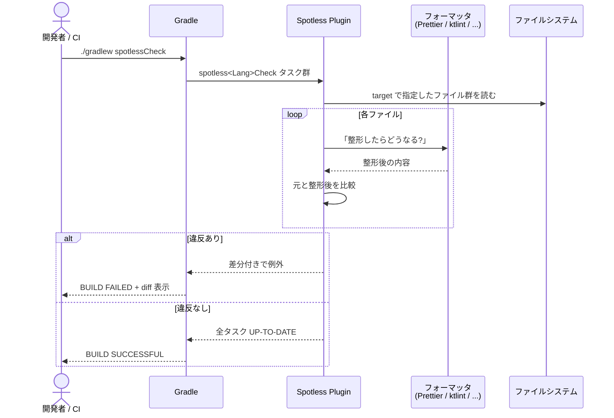
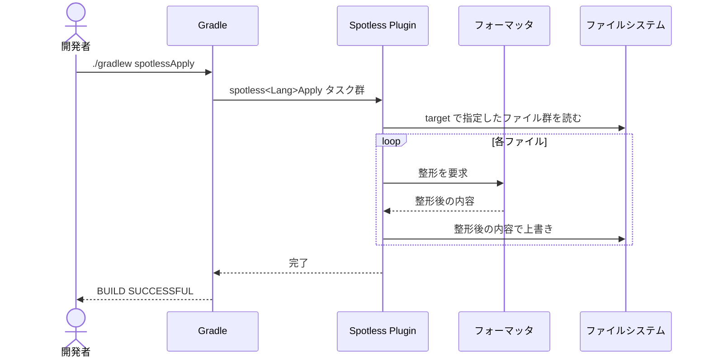
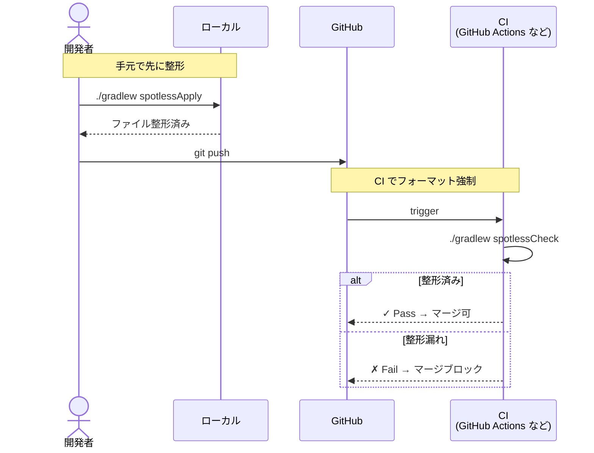
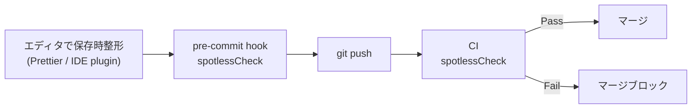

# spotless-demo

[Spotless](https://github.com/diffplug/spotless) (Gradle Plugin) を試すための実験プロジェクト集。

「Spotless 自身はフォーマッタではなく、**フォーマッタを束ねるためのフレームワーク**」という性質を、2 つのサブプロジェクトで体感できるようにした。

## サブプロジェクト

| ディレクトリ | 用途 | 使うフォーマッタ |
|---|---|---|
| [`prettier-web/`](prettier-web/) | JS / TS / CSS / HTML / Markdown / JSON / YAML を **Prettier** で一括 | `prettier("3.3.3")` |
| [`all-in-demo/`](all-in-demo/) | Java / Kotlin / Groovy / SQL / Markdown / JSON / YAML / XML / Protobuf を**全部入り**で | `googleJavaFormat` / `ktlint` / `greclipse` / `jackson` / `dbeaver` / `flexmark` ... |

両方とも **Gradle ベース** (Kotlin DSL) で、**Gradle Wrapper 同梱**。

```sh
./gradlew spotlessCheck   # フォーマット違反を検出 (CI 用)
./gradlew spotlessApply   # 自動修正 (手元用)
```

---

## アーキテクチャ

Spotless 自体は「フォーマッタを呼ぶための仕組み」だけを持つ。実際の整形ロジックはバンドルされた各フォーマッタ jar / Node モジュールが担当する。

```
[build.gradle.kts]
        ↓ 設定 (どのファイルに、どのフォーマッタを当てるか)
[Spotless Gradle Plugin]
        ↓ Maven Central / Node から取得
        ├──→ google-java-format  ┐
        ├──→ ktlint               │
        ├──→ greclipse            │
        ├──→ Jackson (JSON/YAML)  │ → src/**/* を読み書きして整形
        ├──→ dbeaver (SQL)        │
        ├──→ flexmark (Markdown)  │
        ├──→ Prettier (Web 全般)  │
        └──→ buf (Protobuf)       ┘
                ↓
        [src/**/* に書き戻す or 違反を出力]
```

つまり Spotless = **オーケストレーター**、各フォーマッタ = **実行部隊**。

---

## 動作シーケンス

### `./gradlew spotlessCheck` (CI 用: 違反検出)



### `./gradlew spotlessApply` (手元用: 自動修正)



### 実運用での組み合わせ (CI 統合)



ポイント: **`spotlessApply` を pre-commit hook に仕込む** か、**エディタで保存時にフォーマット** しておくと、CI で落ちるのを防げる。

---

## 動かしてみる (3 ステップ)

```sh
# 例: prettier-web の場合
cd prettier-web

# 1) わざと崩したサンプルが入っているので、check は失敗する
./gradlew spotlessCheck
# > Task :spotlessJsonCheck FAILED
# > The following files had format violations:
# >       src/data.json
# >       @@ -1 +1,6 @@ ...

# 2) apply で自動修正
./gradlew spotlessApply
# > BUILD SUCCESSFUL

# 3) 再度 check すると通る
./gradlew spotlessCheck
# > BUILD SUCCESSFUL
```

`all-in-demo/` 側でも同じ流れ。違うフォーマッタの違反 (Java/Kotlin/SQL/Markdown ...) が一度に見られる。

---

## 前提環境

- **Java 11+** (Spotless v6.25.0 が要求。このデモは Java 21 / Corretto で確認)
- **Node.js 16+** (`prettier-web/` のみ。Spotless が内部で npm を呼ぶ)
- Gradle 本体は **不要** (Wrapper 同梱)

---

## Spotless ざっくり

- **ビルドプラグイン**であって、それ自身はフォーマッタを持たない
- 中で `googleJavaFormat` / `ktlint` / `prettier` / `flexmark` / `jackson` / `dbeaver` などを呼ぶ
- 言語ごとに `java {}` `kotlin {}` `format("xxx") {}` のブロックで設定
- 汎用ステップ: `licenseHeader` / `trimTrailingWhitespace` / `endWithNewline` / `indentWithSpaces` / `replaceRegex` / `toggleOffOn`

対応フォーマッタの一覧と詳細は [diffplug/spotless の公式ドキュメント](https://github.com/diffplug/spotless/tree/main/plugin-gradle) を参照。

---

## 汎用ステップ (どの `format {}` ブロックにも入れられる)

言語特有のフォーマッタ (`googleJavaFormat` / `ktlint` / ...) とは別に、Spotless には **言語非依存の汎用ステップ** がある。
`java {}` `kotlin {}` `format(...) {}` のどのブロック内でも使えるので、フォーマッタの上に薄く重ねて整形ポリシーを足せる。

| ステップ | 効果 | 用途 |
|---|---|---|
| `licenseHeader("...")` / `licenseHeaderFile("path")` | ファイル先頭にライセンスヘッダを挿入・強制 | OSS で `/* Copyright ... */` を全ファイルに付ける |
| `trimTrailingWhitespace()` | 行末の空白を削除 | エディタ起因の見えないゴミを掃除 |
| `endWithNewline()` | ファイル末尾に改行を強制 | POSIX 仕様 (テキストは改行で終わる) との整合 |
| `indentWithSpaces(n)` / `indentWithTabs()` | インデントをスペース n 個 or タブに統一 | プロジェクトの indent 規約強制 |
| `replace("name", "old", "new")` | 文字列置換 | API バージョン文字列の一括差し替え |
| `replaceRegex("name", "regex", "replacement")` | 正規表現置換 | 古いライセンスヘッダの書き換え |
| `toggleOffOn()` | `// spotless:off` 〜 `// spotless:on` で囲った範囲を除外 | 手で揃えた表など、整形してほしくない部分の保護 |
| `custom("name") { ... }` | 任意のクロージャでフォーマット | Spotless 標準にないフォーマッタを呼ぶ (Go の `gofmt`、Rust の `rustfmt` など) |

例: フォーマッタの後段に汎用ステップを重ねるパターン。

```kotlin
spotless {
    java {
        target("src/main/java/**/*.java")
        googleJavaFormat("1.22.0")
        // ↓ ここから汎用ステップ
        licenseHeaderFile("$rootDir/config/license-header.txt")
        trimTrailingWhitespace()
        endWithNewline()
        toggleOffOn()  // // spotless:off ～ // spotless:on で部分除外
    }
}
```

---

## Git pre-commit hook での自動実行

「コミット前に整形違反をブロック」をローカルで強制したい場合、pre-commit hook で `spotlessCheck` / `spotlessApply` を呼ぶのが定番。
このリポジトリの [`tools/hooks/`](tools/hooks/) に 2 種類のサンプル hook を置いてある。

### パターン A: 違反があったら commit を中断 (推奨)

[`tools/hooks/pre-commit`](tools/hooks/pre-commit) — `spotlessCheck` を走らせ、違反があれば commit が止まる。
開発者は手で `./gradlew spotlessApply` を叩いてから再 commit する。

```sh
#!/bin/sh
set -e
REPO_ROOT="$(git rev-parse --show-toplevel)"
STAGED=$(git diff --cached --name-only --diff-filter=ACM)

if echo "$STAGED" | grep -q '^prettier-web/'; then
    ( cd "$REPO_ROOT/prettier-web" && ./gradlew --quiet spotlessCheck )
fi
if echo "$STAGED" | grep -q '^all-in-demo/'; then
    ( cd "$REPO_ROOT/all-in-demo" && ./gradlew --quiet spotlessCheck )
fi
```

### パターン B: 自動で整形してステージし直す

[`tools/hooks/pre-commit-apply`](tools/hooks/pre-commit-apply) — `spotlessApply` を走らせ、整形結果をそのままステージに戻す。
開発者は何も意識せず commit でき、勝手に揃う。**「自動でファイルが変わる」のが許容できるチーム向け**。

```sh
#!/bin/sh
set -e
REPO_ROOT="$(git rev-parse --show-toplevel)"
STAGED=$(git diff --cached --name-only --diff-filter=ACM)

run_apply() {
    project="$1"
    ( cd "$REPO_ROOT/$project" && ./gradlew --quiet spotlessApply )
    git diff --name-only -- "$project/" | xargs -r -I{} git add "{}"
}

if echo "$STAGED" | grep -q '^prettier-web/'; then run_apply prettier-web; fi
if echo "$STAGED" | grep -q '^all-in-demo/'; then run_apply all-in-demo; fi
```

### パターン C: pre-commit framework ([pre-commit.com](https://pre-commit.com))

言語横断のフック管理ツール。`.pre-commit-config.yaml` をリポジトリにコミットしておけば、新規メンバーが `pre-commit install` 一発で同じ hook が全員に入る。

```yaml
# .pre-commit-config.yaml
repos:
  - repo: local
    hooks:
      - id: spotless-prettier-web
        name: Spotless (prettier-web)
        language: system
        entry: sh -c 'cd prettier-web && ./gradlew --quiet spotlessCheck'
        pass_filenames: false
        files: ^prettier-web/
      - id: spotless-all-in-demo
        name: Spotless (all-in-demo)
        language: system
        entry: sh -c 'cd all-in-demo && ./gradlew --quiet spotlessCheck'
        pass_filenames: false
        files: ^all-in-demo/
```

### hook を有効化する

`.git/hooks/` は **git で管理されない** ので、`tools/hooks/` に置いたものを使うには `core.hooksPath` を切り替える。

```sh
# clone 直後に 1 回叩く
git config core.hooksPath tools/hooks
```

これで `tools/hooks/pre-commit` がそのまま hook として効くようになる。
apply 版を使いたい場合は:

```sh
ln -sf pre-commit-apply tools/hooks/pre-commit
git config core.hooksPath tools/hooks
```

### 実用のおすすめ構成 (3 層で守る)

```
[エディタ保存時整形]  →  [pre-commit hook]   →  [CI]
 Prettier / IDE plugin    spotlessCheck          spotlessCheck
 (一次防壁)               (二次防壁)              (最終ガード)
```



3 層で守ると **CI で落ちる前に手元で気づける** ので、PR レビューの「フォーマット直してください」コメントが消える。

### 注意点

- `./gradlew spotlessCheck` は **初回が遅い** (Gradle distribution 取得 + 各フォーマッタ jar 取得)。2 回目以降は数秒。
- それでも commit ごとに走るのが嫌なら、`spotless { ratchetFrom 'origin/main' }` で **直近の分岐元との差分ファイルだけ** に対象を絞れる。
- 大きなリポでは `husky` / `lefthook` / `pre-commit` などのフック管理ツールを使うとチーム配布が楽。

---

## このデモを作るときにハマったポイント

`build.gradle.kts` のコメントにも書いてあるが、最初に踏みがちな罠を共有する。

| 現象 | 原因 | 対処 |
|---|---|---|
| `Cannot resolve external dependency ... because no repositories are defined.` | Spotless がフォーマッタ jar を取りに行くリポジトリが未指定 | `repositories { mavenCentral() }` を追加 |
| `Type mismatch: inferred type is String but Action<FlexmarkExtension!>! was expected` | `format("markdown") { flexmark(...) }` と書いた | Markdown は専用 extension の `flexmark { ... }` ブロックを使う |
| `flexmark()` で `No value passed for parameter 'p0'` | 引数省略不可 | `flexmark("0.64.8")` のようにバージョン指定 |
| `Issue processing file: config.yaml` で yaml パース失敗 | サンプル YAML 自体が文法的に不正 (インデント不揃い) | フォーマット崩しは「文法 valid のまま見た目を崩す」だけにする |

---

## ライセンス

このデモコード自体は MIT ライセンス相当 (説明用なので自由に使ってよい)。
バンドルされている Spotless / 各フォーマッタはそれぞれのライセンスに従う。
