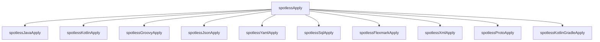

# all-in-demo

Spotless が公式サポートしているフォーマッタを **1 つの Gradle プロジェクトに全部詰め込んだ** デモ。

## 構成

| 言語 / 形式 | フォーマッタ | サンプルファイル |
|---|---|---|
| Java | `googleJavaFormat("1.22.0")` + `removeUnusedImports` + `importOrder` | `src/main/java/com/example/Hello.java` |
| Kotlin | `ktlint("1.3.1")` | `src/main/kotlin/com/example/Greeting.kt` |
| Groovy | `greclipse()` + `importOrder` | `src/main/groovy/com/example/Util.groovy` |
| JSON | `jackson()` | `src/main/resources/data.json` |
| YAML | `jackson()` | `src/main/resources/config.yaml` |
| SQL | `dbeaver()` | `src/sql/init.sql` |
| Markdown | `flexmark("0.64.8")` | `src/main/resources/note.md` |
| XML | 汎用ステップのみ (`trimTrailingWhitespace` / `endWithNewline` / `indentWithSpaces(2)`) | `src/main/resources/schema.xml` |
| Protobuf | 汎用ステップのみ (`buf` は別途バイナリが必要) | `src/main/proto/message.proto` |
| `*.gradle.kts` | `ktlint("1.3.1")` | `build.gradle.kts` |

## 動かし方

```sh
./gradlew spotlessCheck   # 違反検出
./gradlew spotlessApply   # 自動修正
```

## フォーマッタ → ファイル のマッピング

```mermaid
flowchart LR
    BG[build.gradle.kts] --> SP[Spotless Plugin]

    SP -->|java&#40;&#41;| GJF[googleJavaFormat 1.22.0]
    SP -->|kotlin&#40;&#41;| KL[ktlint 1.3.1]
    SP -->|groovy&#40;&#41;| GE[greclipse]
    SP -->|json&#40;&#41;| JS[Jackson]
    SP -->|yaml&#40;&#41;| JY[Jackson]
    SP -->|sql&#40;&#41;| DB[dbeaver]
    SP -->|flexmark&#40;&#41;| FM[flexmark 0.64.8]
    SP -->|format&#40;'xml'&#41;| GN[trim + newline + indent]
    SP -->|format&#40;'proto'&#41;| GN

    GJF --> J["src/main/java/**/*.java"]
    KL --> K["src/main/kotlin/**/*.kt"]
    GE --> G["src/main/groovy/**/*.groovy"]
    JS --> JN["src/main/resources/**/*.json"]
    JY --> Y["src/main/resources/**/*.yaml"]
    DB --> SQ["src/sql/**/*.sql"]
    FM --> MD["src/**/*.md"]
    GN --> X["src/main/resources/**/*.xml"]
    GN --> P["src/main/proto/**/*.proto"]
```



## タスクツリー (実際に走る Gradle タスク)

`./gradlew spotlessApply` を 1 回叩くと、内部ではこれだけのサブタスクが順に走る。



`spotlessCheck` 側も対称的に `spotlessJavaCheck` / `spotlessKotlinCheck` / ... が並ぶ。

## フォーマッタごとの挙動 (実際の整形結果から)

| フォーマッタ | 特徴 | 例 |
|---|---|---|
| `googleJavaFormat` | Google 社内スタイル。2-space indent、`for` の `(` 前に space | `for(String n:names)` → `for (String n : names) {` |
| `ktlint` | Kotlin 公式スタイル準拠。単一式関数化、trailing comma | `fun greet(...) { return ... }` → `fun greet(...): String = ...` |
| `greclipse` | Eclipse Groovy 系。タブインデント (デフォルト) | スペース→タブに変わる |
| `Jackson (JSON)` | Pretty print、配列/オブジェクト周りに space | `{"a":1}` → `{\n  "a" : 1\n}` |
| `Jackson (YAML)` | 全文字列を `"..."` で quote、`---` start marker | `host: localhost` → `host: "localhost"` |
| `dbeaver` | SQL キーワード大文字化、`SELECT/FROM/WHERE` 縦並び | `select u.id from user u` → `SELECT\n    u.id\nFROM\n    user u` |
| `flexmark` | Markdown のテーブル整列、行末スペース除去 | `\| 1 \| 2 \|` → `\| 1 \| 2 \|` (列幅統一) |

## 注意

- このプロジェクトは **コンパイルする目的では作っていない** (java/kotlin/groovy プラグインを適用していない)
- Spotless だけ動かして「ブロック単位で別々のフォーマッタを差し込める」ことを見るためのもの
- `greclipse()` / `dbeaver()` / `flexmark()` は初回実行時に Maven Central から jar をダウンロードする

## 本気で XML / Protobuf もフォーマットしたい場合

```kotlin
// XML — Eclipse WTP の XML フォーマッタ
format("xml") {
    target("src/main/resources/**/*.xml")
    eclipseWtp(com.diffplug.spotless.extra.wtp.EclipseWtpFormatterStep.XML)
}

// Protobuf — buf バイナリが PATH に必要 (brew install buf)
protobuf {
    target("src/main/proto/**/*.proto")
    buf()
}
```
