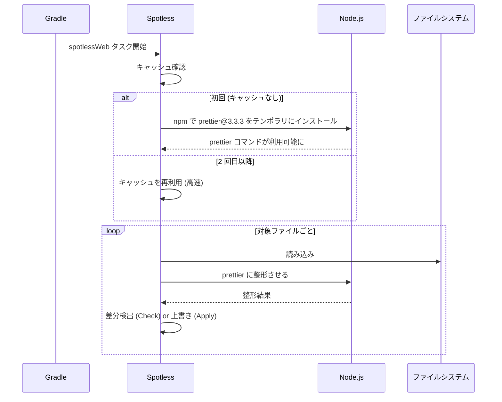

# prettier-web

Spotless から **Prettier** を呼んで Web 系ファイルを一括フォーマットするデモ。

## 対象

| 拡張子 | 言語 |
|---|---|
| `.js` / `.ts` / `.jsx` / `.tsx` | JavaScript / TypeScript |
| `.css` / `.scss` | CSS / SCSS |
| `.html` | HTML |
| `.md` | Markdown |
| `.json` | JSON |
| `.yaml` / `.yml` | YAML |

## 動かし方

```sh
./gradlew spotlessCheck   # 違反検出 (サンプルがわざと崩してあるので失敗する)
./gradlew spotlessApply   # 自動修正
./gradlew spotlessCheck   # 今度は通る
```

## フォーマッタチェーン

```mermaid
flowchart LR
    BG[build.gradle.kts] --> SP[Spotless Plugin]
    SP -->|format&#40;'web'&#41;| PR[Prettier 3.3.3]
    SP -->|json&#40;&#41;| PR
    SP -->|yaml&#40;&#41;| PR
    SP -->|format&#40;'misc'&#41;| GN[trimTrailingWhitespace<br/>+ endWithNewline]
    SP -->|kotlinGradle&#40;&#41;| KT[ktlint]

    PR -->|拡張子から parser 自動推定| FILES1[".js / .ts / .css /<br/>.html / .md /<br/>.json / .yaml"]
    GN --> FILES2[".gitignore / README.md"]
    KT --> FILES3[".gradle.kts"]
```



## 初回実行時の動き

Prettier ステップは **Node.js + npm** を内部で呼ぶ。
初回は `~/.gradle/...` 配下に Prettier のテンポラリ環境を展開する。



そのため、初回の `./gradlew spotlessCheck` だけ少し時間がかかる。
2 回目以降はキャッシュが効くため高速。

## ファイル

| パス | 言語 | わざとの崩し |
|---|---|---|
| `src/index.js` | JavaScript | 余分なスペース、無駄な括弧 |
| `src/app.ts` | TypeScript | 型注釈の詰めすぎ、改行不足 |
| `src/style.css` | CSS | プロパティ間スペースなし |
| `src/page.html` | HTML | 一行に詰めすぎ |
| `src/doc.md` | Markdown | 行末スペース、リストのインデント崩れ |
| `src/data.json` | JSON | 全部一行 |
| `src/config.yaml` | YAML | インデント乱れ (文法は valid) |

## カスタマイズ例

```kotlin
// 行幅を 100 に
prettier("3.3.3").config(mapOf("printWidth" to 100))

// .prettierrc を参照させたい
prettier("3.3.3").configFile(".prettierrc.json")

// parser を強制
prettier("3.3.3").config(mapOf("parser" to "babel"))
```
